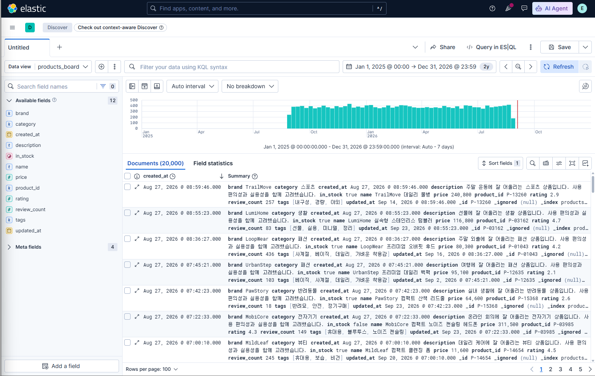
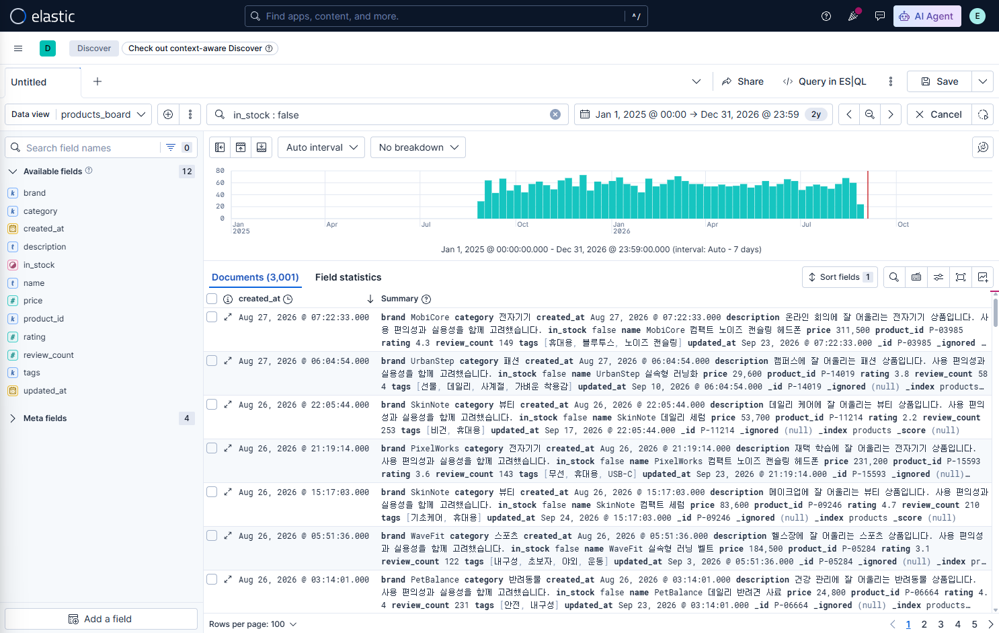
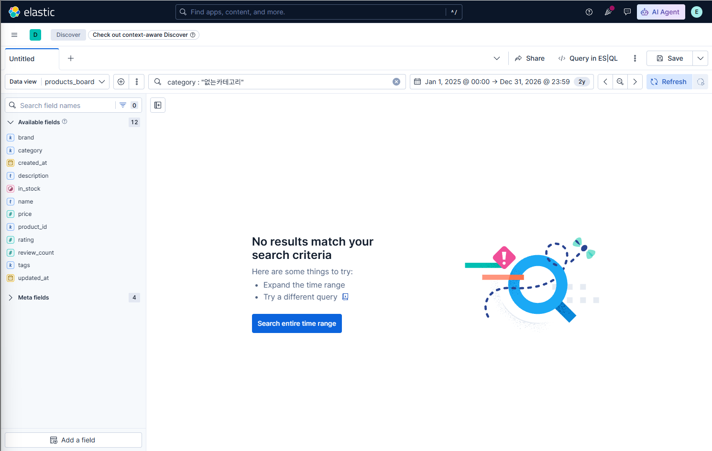

# 1교시 연습 — Data View·Discover·KQL·데이터 준비 상태

- 필수 권장 시간: 38분
- 선택 도전: 7분
- 제출 상태 확인: 5분
- 시작 기준: Kibana 접속 가능
- 화면 순서: [Data View·Discover 상세 가이드](../KIBANA_9_5_STEP_BY_STEP.md#1-data-view-만들기-또는-기존-data-view-확인하기)

## (공통·필수) 문제 1 — Dashboard를 만들 수 있는 데이터인지 확인

* 선택한 Data View 이름: `products_board`
* index pattern: `products`
* time field: `created_at`
* 확인한 7개 field:

  * `product_id`
  * `name`
  * `category`
  * `brand`
  * `price`
  * `in_stock`
  * `created_at`
* 사용한 절대 시간 범위: 실제 설정한 범위 입력
* Discover 실제 문서 수: **20,000건**
* 정상/보류/오류: **정상**
* 판정 근거: `products` Data View에서 필요한 7개 field가 존재하고, 전체 문서 수가 강의 기준인 20,000건으로 확인되어 Dashboard를 만들 수 있는 데이터 상태라고 판단했다.
* 캡처 파일: 

## (공통·필수) 문제 2 — KQL 적용 전후 비교

| 확인 항목 |   적용 전 |  적용 후 |    KQL 제거 후 |
| ----- | -----: | ----: | ----------: |
| 문서 수  | 20,000 | 3,001 | KQL 제거 후 확인 |

* 적용 후 대표 문서 ID 2개:

  1. `P-03985`
  2. 두 번째 문서 확인 후 입력

* `in_stock` 값 확인:

  * `P-03985` → `false`
  * 두 번째 문서 → 확인 후 입력

* 복구 성공 여부:
  → KQL을 삭제한 뒤 문서 수가 다시 20,000건으로 돌아오면 성공

* 캡처 파일:
  → `evidence/day-04-practice/p01-q02-kql-filter.png`

  

* KQL이 데이터를 삭제한 것인가? 이유:
  → 아니다. `in_stock : false` KQL은 Elasticsearch의 데이터를 삭제한 것이 아니라, Discover 화면에서 `in_stock` 값이 `false`인 문서만 필터링해서 보여준 것이다. KQL을 제거하면 다시 전체 20,000건을 확인할 수 있다.

## (진단·필수) 문제 3 — 0건 또는 일부 데이터만 보이는 상황 복구

다음 상황을 가정합니다.

> Discover에서 데이터가 0건이거나 예상보다 적게 보인다. index가 지워졌다고 단정하지 않고 원인을 확인한다.

아래 순서로 현재 화면을 점검하세요.

1. 시간 범위
2. 선택한 Data View
3. KQL 입력
4. filter pill
5. field가 실제 mapping에 존재하는지

실제 화면에서 조건 하나를 일부러 적용해 건수를 줄였다가 다시 복구해도 됩니다.

### 진단 기록

- 재현한 증상: 'category : "없는카테고리" KQL을 적용하여 Discover 결과가 0건으로 표시되도록 했다.'
- 마지막 정상 상태: 'products_board' Data view에서 전체 20,000건이 정상적으로 조회되는 상태였다.
- 확인한 항목과 순서: 
    1. 시간 범위 확인
    2. Data View 확인
    3. KQL 입력 확인
    4. filter pill 확인
    5. field 존재 여부 확인
- 발견한 원인:
    - 실제 데이터에 존재하지 않는 category 값을 검색하는 KQL이 적용되어 있었다.
- 수정한 내용:
    - 'category : "없는카테고리"' KQL을 삭제했다.
- 수정 후 문서 수:
    - 20,000건
- 다음부터 먼저 확인할 항목:
    - 시간 범위와 KOL/filter 조건을 먼저 확인한다.
- 캡처 파일: `evidence/day-04-practice/p01-q03-zero-result.png`

## (개인·필수) 문제 4 — 내 데이터 준비 상태 카드

자기 index 또는 준비 중인 데이터에서 Dashboard 질문 하나를 정하고 필요한 field를 점검하세요. 개인 Data View가 아직 없다면 mapping·샘플 문서로 판단합니다.

### 개인 답안

- 내 주제: 만화책 검색
- 한 문서가 의미하는 대상 또는 사건: 만화 작품 1개
- Dashboard 사용자: 만화책 회사 관계자
- 사용자가 내릴 판단: 장르별 작품 구성과 가격대를 확인하고, 보유한 만화 데이터의 특성을 파악한다.
- 첫 분석 질문: 장르별 작품 수와 평균 종이책 가격은 어떻게 다른가?
- 필요한 field:
    - 'manga_id'
    - 'genre'
    - 'paper_price'
- 각 field의 mapping type:
    - 'manga_id' : 'keyword'
    - 'genre' : 'keyword'
    - 'paper_price' : 'integer'
- 실제 존재 여부:
    - 모두 존재
- 데이터 문서 수:
    - 확인 후 입력
- A 개인 데이터 사용 / B 공통 products 사용+보강 설계 / C 공통 실습+개인 청사진 중 선택:
    - A 개인 데이터 사용
- 선택 이유:
  - `manga-books`에 장르와 가격 등 Dashboard 분석에 필요한 field가 실제로 존재하고 있어 개인 데이터로 시각화를 만들 수 있다.

- 부족한 데이터와 다음 행동:
  - 현재 데이터에는 판매량, 조회수와 같은 인기 지표가 없어 실제 작품의 인기도는 판단하기 어렵다.
  - 현재는 장르별 작품 수, 가격, 연재 상태 등의 데이터로 Dashboard를 구성하고, 향후 실제 인기 데이터를 확보할 수 있다면 판매량이나 조회수 field를 추가한다.

## (선택 도전) 문제 5 — 서로 다른 KQL 3개 설계

`products`에서 category, price, in_stock 중 서로 다른 field를 사용한 KQL 3개를 만들고, 한 번에 한 조건만 실행하세요.

| KQL | 질문 | 결과 수 | 대표 문서 | 조건 제거 후 20,000 복구 |
|---|---|---:|---|---|
| `category : "전자기기"` | 전자기기 상품은 몇 개인가? | 2,500 | 전자기기 문서 1개 확인 | O |
| `price >= 200000` | 가격이 20만 원 이상인 상품은 몇 개인가? | 2,893 | 20만 원 이상 상품 1개 확인 | O |
| `in_stock : true` | 현재 재고가 있는 상품은 몇 개인가? | 16,999 | `in_stock: true` 문서 1개 확인 | O |

## 교시 완료 신호

- GREEN: 필수 1~4 완료, 마지막 상태 20,000, KQL/filter 없음
- YELLOW: 결과는 있으나 수치·시간·field 중 하나가 다름
- RED: Data View 또는 Discover에서 데이터를 확인할 수 없음
